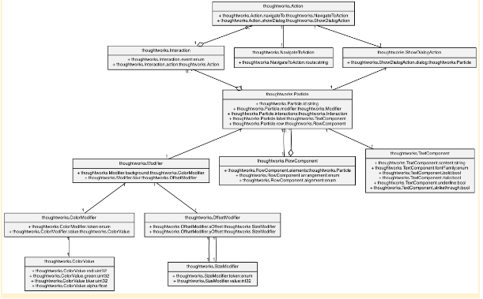

# Revolutionize UI development with a general Server-Driven UI model

## The future of UI development?

Server-Driven UI (User Interface) is an approach to building mobile or web applications where the UI is defined and
rendered on the server-side, and then delivered to the client-side for display. In this approach, the client application
is responsible only for displaying the UI that it receives from the server, and for handling user interactions and
events.

The server-side code generates the UI based on the business logic and user data, and can dynamically update the UI as
needed. This approach has several benefits, such as:

Updating the client application dynamically without release.
Making A/B testing and experimentation easier allows for easy decision-making on product iterations.
Writing the business logic only on one end, improving team collaboration efficiency.

Server-Driven UI(it will be replaced with the abbreviation 'SDUI' subsequently) is often used in modern mobile and web
applications, especially those that require frequent UI updates and a consistent user experience across multiple
platforms and devices.

Since there is currently no available open-source framework for building such a system, I propose a framework called '
Particle' for building SDUI, aiming to provide a generic model for this approach.

## How to abstract the UI？

The key to the success of a SDUI framework is to ensure the stability of the UI abstraction layer. To build a UI data
model that takes into account ease of use, maintainability, and extensibility, Particle defines three different parts.

- Structure: structure refers to the layout relationship between various components on a page. We can divide a page into
several sections, with each section containing multiple page elements. Different sections can use different layout
styles, such as vertical, horizontal, or grid layout.

- Elements: elements are the visible parts of a webpage, including text, images, buttons, forms, and lists. Each element
has its own properties and styles, such as font, color, size, background, etc.

- Interaction: interaction generally refers to various operations performed by users on the page and the feedback they
receive. Operations include clicking, sliding, inputting, zooming, rotating, etc. Feedback includes form submissions,
page state changes, permission request prompts, and animations, etc.

This is a common abstraction model in frontend development that describes the composition, style, and interactive
behavior of an application screen/page. It can be applied in various frontend frameworks and development tools, such as
React, Vue, Angular, SwiftUI, Compose, etc.

In the part of interaction, there are also some non-user behaviors. For example, in the scenario where "the loading
prompt pops up when the Home page of the application is first displayed on the screen," we can understand "displayed on
the screen for the first time" as an operation, and "popping up the loading prompt box" as its feedback. In light of
this, we collectively refer to all operations as `Event`s, and all feedbacks as `Action`s

## How to model it?

Using this abstraction, we can model the pages or screens of an application. We call the abstract object of the UI a "
Particle," which is composed of an element or layout (container). The page properties and styles are referred to as "
Modifiers," and page interactions are referred to as "Interactions." It's worth noting that a page may have multiple
interactions.

It's crucial to note that when a Particle is composed of a layout, such as RowComponent, the child element of this
layout must also be a Particle. This ensures that the Particle model can accurately describe all UI pages.

## How to collaborate across processes?

The client and server can communicate using network protocols such as HTTP and WebSocket. The typical workflow involves,
- The client requests the agreed endpoint for obtaining the UI rendering data of the application/page.
- The server generates UI data according to the parameters carried in the client request, and responses it to the client
in sequence.
- The client needs to implement all the functions mentioned in the modeling chapter. Now, the UI data responded by the
server will be drawn and bound to the interactive events in the data, such as button click, text input, etc., and form
submission.

In SDUI, WebSocket can be used to enable two-way communication, allowing the server to push UI updates or data changes
to the client in real-time. After establishing a WebSocket connection with the server, the client can receive updates
related to UI layout, style, and data through the connection, thereby ensuring timely interface updates. Compared to the
traditional HTTP request-response mode, WebSocket can push real-time data and UI changes more efficiently, thereby
improving the overall user experience and interactivity.

### Data and logic stay in the backend

In SDUI, the server plays a pivotal role in generating the UI data, such as page structure, layout, element style, and
interaction events. The server can create diverse UI data based on different users, scenarios, and conditions, which
facilitates personalization and dynamism of the UI.
However, it's important to note that the server's responsibilities are not limited to providing UI data. It also needs
to handle business logic, data storage, security verification, and performance optimization to ensure the accuracy,
dependability, and efficiency of the UI.

### Client is a page or application container

The client's primary responsibility is to parse UI description data from the server, and parse and render it into an
actual user interface. This involves implementing UI element layout, style, interactive behavior, and other features,
and continuously updating and refreshing the UI based on data returned by the server to provide users with the latest UI
experience. Additionally, the client must implement data interaction and communication with the server to ensure
synchronization and consistency of UI data.

When using Jetpack Compose or SwiftUI to build a mobile application, the UI data from the previous chapter can easily be
converted into corresponding @Composable components and View objects.

Importantly, the client does not need to be concerned with the business logic or UI presentation of the server when
implementing it. It must implement all the content described in the entire Particle model, including all Elements,
Layouts, Modifiers, and Interactions, in order to render the expected UI page at runtime.

## Challenges in this model

- Abstracting a general Action from a specific scene
For instance, consider a user login button that triggers a form submission. To handle such actions, we may need to
define a general-purpose CopyPasteAction, which can replace the appropriate placeholder in the form URL with a specific
section of text (or other types of data) . Predictably, there are numerous scenarios that necessitate abstraction.

- All about UI building 
When considering releasing an application to the global market, developers need to take into account factors such as
culture, language, and regional differences to provide multilingual support, appropriate time and date formats, currency
symbols, color schemes, etc. In addition, to enhance user satisfaction and increase market share, developers may need to
translate text, adjust interface layouts, use localized icons and images, and comply with local regulations. These
challenges also exist in Particle modeling, and may require more effort to be addressed on the server side.

